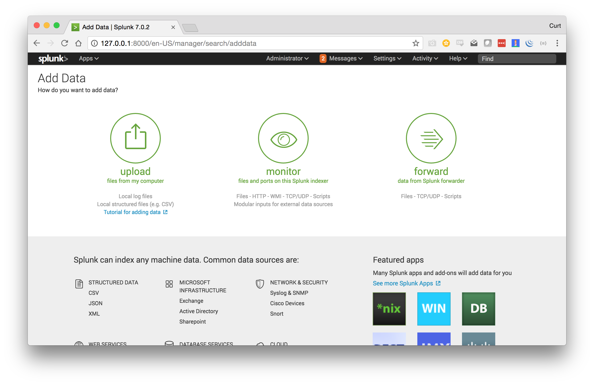

# Reaper Splunk Plugin Quickstart Guide

The Reaper Splunk Plugin helps you separate the signal from the noise in your Splunk queries. If you are running a service that faces the internet, you likely see thousands of scans, bots, and brute force attempts every day. These scans add noise to your SIEM, and make it hard to find legitimate events of interest.

The Reaper Splunk Plugin is a utility that leverages the TheshingFloor API to reduce noisy entries from your Splunk Queries. This tool is currently in ALPHA and will be available for free with rate-limited accounts on a trial basis.

## How it Works

Reaper is powered by a network of sensors that are deployed across the internet. These sensors have no business value, but have a comprehensive set of logging rules. These logs are aggregated and analyzed before being loaded into a database that is made available through the ThreshingFloor API. Reaper analyzes your log files and SIEM queries, and passes metadata to our API. The API returns a filter based on your metadata that is then applied to your query. The result is less noisy Splunk query results.

## Examples

First you must load apache logs and auth logs, but once those are added, you can reduce in the style shown below. Reaper will attempt to guess the type automatically.

Attempt to automatically identify the type of log, and reduce it.
```
source="apache_sample.log" | reaper 
```

Attempt to automatically reduce noise from an Apache access log file.
```
source="apache_sample.log" | reaper logtype=http
```

Attempt to automatically reduce noise from an auth log file.
```
source="auth.log"| reaper logtype=auth
```

Reduce noise from TCP port 80 and 443 traffic from an Apache access log.
```
source="apache_sample.log" | reaper logtype=generic ports=80:tcp;443:tcp 
```

## Installation

This plugin can be installed on an existing Splunk instance directly, pulled down and converted to a tarball and installed through the Splunk interface, or downloaded and installed on a fresh version of Splunk using docker.

### Installing Directly on Splunk

Connect to your Splunk instance over SSH and issue the following commands:

```
$ cd /opt/splunk/etc/apps
$ git pull --recursive git@github.com:ThreshingFloor/splunk.reaper.threshingfloor.io.git
```

### Downloading release

To install on Splunk with a tarball, simply download this repositories latest release, or execute the following command on your local system:

```
$ TODO
```

Then navigate to the web interface of your Splunk instance and add a plugin. Select the tar file you just downloaded when prompted.

### Testing with Docker
This plugin can be run on a fresh instance of Splunk with Docker using the following commands:
```
$ git clone git@github.com:ThreshingFloor/splunk.reaper.threshingfloor.io.git
$ docker run -p 8000:8000 -d --env SPLUNK_START_ARGS="--accept-license" -e "SPLUNK_USER=root" -v ~/splunk.reaper.threshingfloor.io/:/opt/splunk/etc/apps/threshingfloor splunk/splunk
```

Note that this command needs you to share the plugin directory as a volume with `-v`. 

Then navigate to http://127.0.0.1:8000 in your web browser.

## Setup

Follow these steps to set up your fresh Splunk instance with Reaper.

### Configuration

After installation, you will be presented with a configuration panel. Insert your API key here which can be found in ~/.tf.cfg on your system. If you don't have this file, install the CLI tool (git@github.com:ThreshingFloor/cli.reaper.threshingfloor.io.git) and run it with the --configure option set, or request an API key from info@threshingfloor.io.


### Data import

Click on the splunk logo in the top left corner to go to the main Splunk homepage.


Select "Add Data".



Select "Upload Files from my Computer" and follow the instructions.


### Running for the first time

Navigate to the Splunk homepage, and click "Reaper" from the list of plugins on the left. On the next screen, select a data source that was uploaded in the previous step. You may need to adjust the time window so your query will return results.


Run a query, and then add a pipe to the `reaper` command with the appropriate type set, as seen below.


Look below for other examples of commands that can be run with Reaper.

## Privacy Notice

In order to reduce noise from your queries, we need to collect metadata from those them. This includes IP addresses, usernames, user agent strings, referrers, and request URIs. We use this metadata to enchance the results of our API. If you have sensitive data in your log files or prefer to not share this data with us, contact us at info@threshingfloor.io about a private on-premesis solution.
